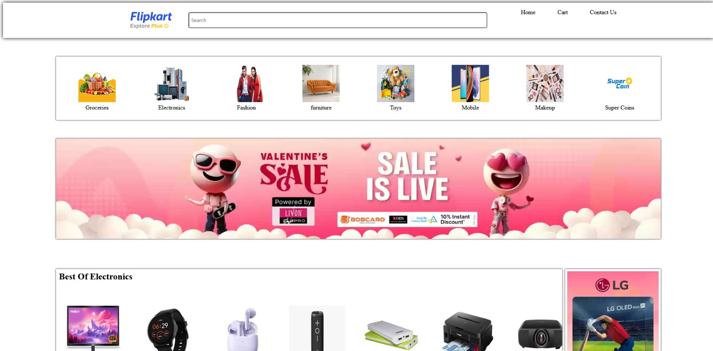
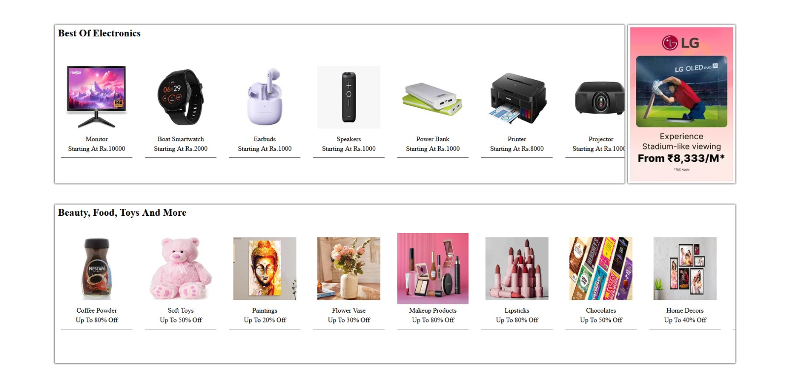

# 🛒 Flipkart Clone

<div align="center">


A responsive **Flipkart homepage clone** built using **HTML5** and **CSS3**, replicating the layout and design of one of India's largest e-commerce platforms.

</div>

---

# 📖 Overview

This project recreates the Flipkart homepage to practice modern web design, responsive layouts, Flexbox, CSS positioning, and UI development.

The focus was on building a clean and visually appealing interface similar to the original website.

---

# ✨ Features

- 🛒 Flipkart-inspired homepage
- 📱 Responsive layout
- 🔍 Search bar
- 📂 Product categories
- 🏷️ Product sections
- 🧭 Navigation bar
- 🎨 Clean UI using HTML & CSS

---

# 🛠 Tech Stack

- HTML5
- CSS3

---

# 📸 Screenshots

## Home



---

## Products



---

## Categories


---

# 📂 Project Structure

```text
Flipkart-Clone/
│
├── Screenshots/
├── css/
├── img/
├── index.html
└── README.md
```

---

# 🚀 Run Locally

Clone the repository

```bash
git clone https://github.com/VijayalaxmiSankpal/Flipkart-Clone.git
```

Open `index.html` in your browser.

---

# 💡 Future Improvements

- JavaScript functionality
- Product slider
- Login page
- Shopping cart
- Product details page
- Dark mode

---

# 👩‍💻 Author

**Vijayalaxmi Sankpal**

📧 vijayalaxmisankpal@gmail.com

💼 LinkedIn  
https://www.linkedin.com/in/vijayalaxmi-sankpal-b99b4a25b

💻 GitHub  
https://github.com/VijayalaxmiSankpal

---

# ⭐ Support

If you found this project helpful, consider giving it a ⭐ on GitHub.

---

<div align="center">

**Built with HTML & CSS 🚀**

</div>